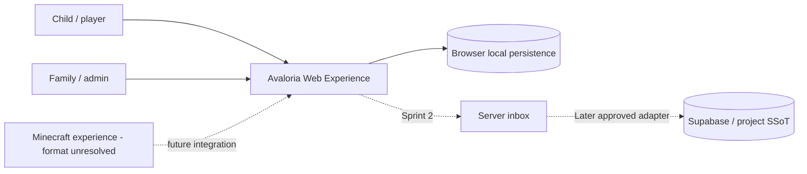
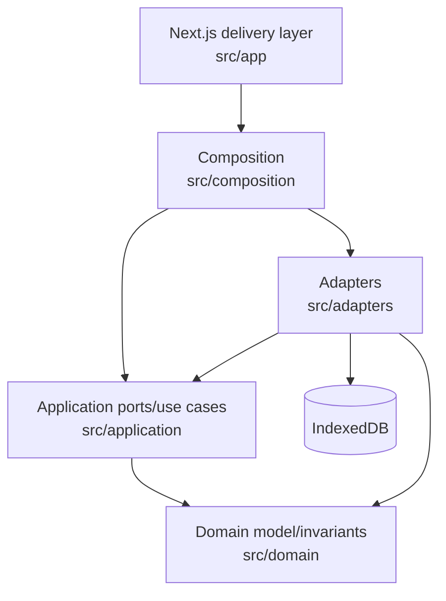

# C4-lite views

## System context

```mermaid
flowchart LR
  Child[Child / player] --> Web[Avaloria Web Experience]
  Adult[Family / admin] --> Web
  Web --> Local[(Browser local persistence)]
  Web -. Sprint 2 .-> Inbox[Server inbox]
  Inbox -. Later approved adapter .-> Supabase[(Supabase / project SSoT)]
  Minecraft[Minecraft experience - format unresolved] -. future integration .-> Web
```

## Current containers/modules

```mermaid
flowchart TB
  UI[Next.js delivery layer\nsrc/app]
  COMP[Composition\nsrc/composition]
  ADAPTERS[Adapters\nsrc/adapters]
  APP[Application ports/use cases\nsrc/application]
  DOMAIN[Domain model/invariants\nsrc/domain]
  IDB[(IndexedDB)]

  UI --> COMP
  COMP --> APP
  COMP --> ADAPTERS
  ADAPTERS --> APP
  APP --> DOMAIN
  ADAPTERS --> DOMAIN
  ADAPTERS --> IDB
```

Dependency rule: lower-level domain/application code must not import Next.js or concrete adapters.
